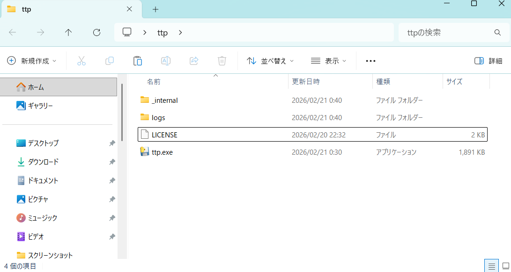
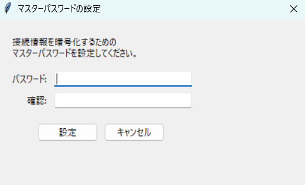
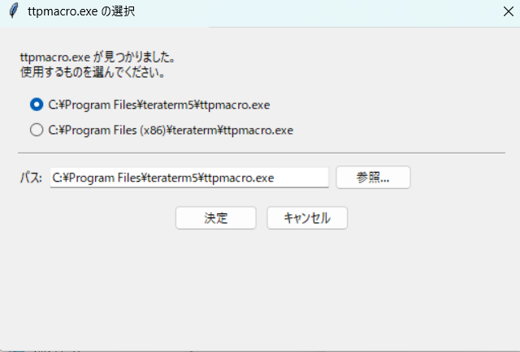
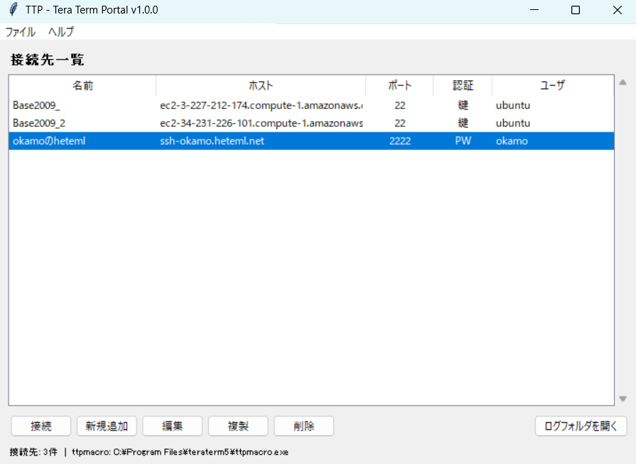
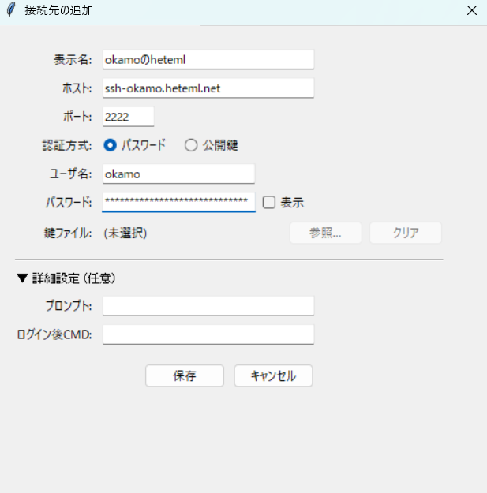
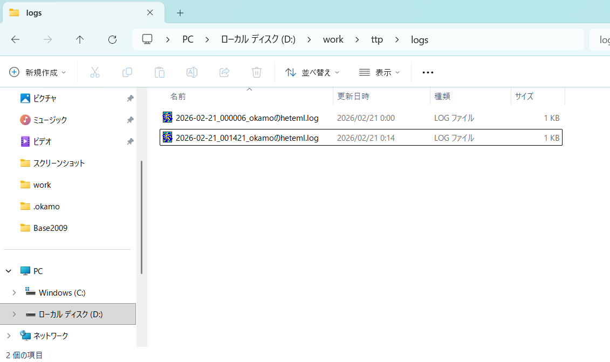
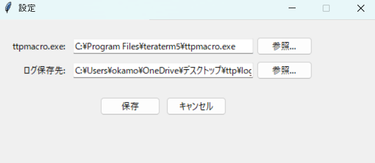

# TTP - Tera Term Pilot 使い方マニュアル

## TTP とは？

**TTP (Tera Term Pilot)** は、Tera Term マクロ (ttpmacro.exe) を GUI で管理・実行するための Windows デスクトップアプリケーションです。

### こんな悩みを解決します

| よくある困りごと | TTP なら |
|---|---|
| 接続先ごとにマクロファイルを手書きしている | GUI で登録するだけ。マクロは自動生成 |
| パスワードがマクロ内に **平文で書かれている** | AES 暗号化で保存。マクロファイルにパスワードは残らない |
| 秘密鍵ファイルのパスを毎回探している | 一度パスを登録すればワンクリック接続 |
| ログを取り忘れる | 接続時に **自動でログファイルを生成**。忘れることがない |
| Tera Term の設定をチームで共有しにくい | ポータブル設計。フォルダごとコピーするだけ |

### 特徴

- **ワンクリック接続** — 接続先を選んでダブルクリックするだけ
- **接続情報の暗号化** — パスワード・接続情報はマスターパスワードで暗号化 (AES-256 / Fernet)
- **自動ログ記録** — 接続時にタイムスタンプ付きログファイルが自動生成される
- **ttpmacro.exe 自動検出** — インストール済みの Tera Term を自動検出
- **ポータブル** — zip を解凍するだけで使える。レジストリ不使用
- **MIT ライセンス** — 商用利用含め自由に利用可能

---

## インストール

### 動作要件

- **OS**: Windows 11（Windows 10 は Microsoft のサポートが終了しているため非推奨）
- **Tera Term**: Tera Term 4 または Tera Term 5 がインストールされていること（ttpmacro.exe が必要）

### 手順

1. `ttp-x.x.x.zip` を任意のフォルダに展開します
2. 展開先には以下のファイルが含まれています



> **ヒント**: デスクトップや `C:\Tools\ttp\` など、分かりやすい場所に置くのがおすすめです。  
> Program Files 配下は権限の問題が起きる場合があるため避けてください。  
> **注意**: セットアップ後にフォルダ名やフォルダの場所を変更すると、設定の再構成が必要になります（[トラブルシューティング](#フォルダ名やフォルダの場所を変更したら接続できなくなった)参照）。

3. `ttp.exe` をダブルクリックして起動します

<!-- TODO: exeを起動する画像を追加 -->

---

## アンインストール

**フォルダごと削除するだけ** で完了です。

TTP はレジストリや AppData などの外部フォルダにデータを一切保存しません。  
接続設定・暗号化データ・ログもすべて TTP フォルダ内に保存されているため、フォルダを削除すればクリーンアップは完了です。

---

## 初回セットアップ

### 1. マスターパスワードの設定

TTP を初めて起動すると、マスターパスワードの設定画面が表示されます。



#### マスターパスワードとは？

マスターパスワードは、登録した接続情報（ホスト名・ユーザ名・パスワード等）を **暗号化するための鍵** です。

- 接続情報は **AES-256 (Fernet) で暗号化** されてディスクに保存されます
- マスターパスワードから暗号鍵を導出する際は **PBKDF2 (480,000回反復)** を使用しており、総当たり攻撃に対して強固です
- マスターパスワード自体は保存されません（検証用トークンのみ保存）

#### よくある質問

| 質問 | 回答 |
|---|---|
| **毎回同じ値を入力するの？** | はい。起動のたびに同じマスターパスワードを入力してください。これにより接続情報が復号されます |
| **間違えるとどうなる？** | 「パスワードが違います」と表示されます。**3回間違えるとアプリが終了** します。再度起動すればまた3回試行できます |
| **忘れたらどうなる？** | 接続情報を復号できなくなります。`ttp_data` フォルダを削除して最初から設定し直す必要があります |
| **後から変更できる？** | はい。メニューの「ファイル → マスターパスワード変更」から変更できます。接続情報は新しいパスワードで自動的に再暗号化されます |
| **4文字未満は設定できる？** | いいえ。セキュリティのため4文字以上が必要です |

### 2. ttpmacro.exe の選択

マスターパスワードの設定後、ttpmacro.exe の選択画面が表示されます。



- TTP は以下の場所を **自動検索** します:
  - `C:\Program Files\teraterm5\ttpmacro.exe` (Tera Term 5)
  - `C:\Program Files (x86)\teraterm5\ttpmacro.exe`
  - `C:\Program Files\teraterm\ttpmacro.exe` (Tera Term 4)
  - `C:\Program Files (x86)\teraterm\ttpmacro.exe`
- 自動検出された ttpmacro.exe がラジオボタンで表示されるので、使用したいものを選んで「決定」を押してください
- 見つからない場合は「参照...」ボタンから手動で選択できます

> **注意**: Tera Term 5 と Tera Term 4 の両方がインストールされている場合、両方が表示されます。通常は新しいバージョン (Tera Term 5) の選択を推奨します。

---

## 接続先一覧画面

初回セットアップが完了すると、メインの接続先一覧画面が表示されます。



### 画面構成

| 要素 | 説明 |
|---|---|
| **接続先一覧 (テーブル)** | 登録済みの接続先が一覧表示されます。名前・ホスト・ポート・認証方式・ユーザ名が確認できます |
| **接続** ボタン | 選択した接続先に Tera Term で接続します |
| **新規追加** ボタン | 新しい接続先を登録します |
| **編集** ボタン | 選択した接続先の設定を変更します |
| **複製** ボタン | 選択した接続先をコピーして新しいエントリを作成します（似た設定の接続先を素早く追加できます） |
| **削除** ボタン | 選択した接続先を削除します（確認ダイアログが表示されます） |
| **ログフォルダを開く** ボタン | ログの保存先フォルダをエクスプローラーで開きます |

### 接続方法

1. 一覧から接続先を選択
2. **ダブルクリック** または **「接続」ボタン** をクリック（Enter キーでも可）
3. Tera Term が起動し、SSH 接続とログ記録が自動的に開始されます

### テーブルの操作

- **列ヘッダーをクリック** すると、その列でソートできます（クリックするたびに昇順/降順が切り替わります）

### キーボードショートカット

| キー | 操作 |
|---|---|
| `Enter` / ダブルクリック | 接続 |
| `Ctrl + N` | 新規追加 |
| `Ctrl + E` | 編集 |
| `Ctrl + D` | 複製 |
| `Delete` | 削除 |
| `Ctrl + L` | ログフォルダを開く |
| `Ctrl + ,` | 設定 |

---

## 接続先の登録・編集

「新規追加」または「編集」をクリックすると、接続先の登録画面が開きます。



### 基本設定

| 項目 | 説明 | 例 |
|---|---|---|
| **表示名** | 一覧に表示される名前（自由に付けられます） | `本番サーバ A` |
| **ホスト** | 接続先のホスト名または IP アドレス | `192.168.1.100` |
| **ポート** | SSH ポート番号（デフォルト: 22） | `22` |
| **認証方式** | 「パスワード」または「公開鍵」を選択 | — |
| **ユーザ名** | SSH ログインユーザ名 | `admin` |
| **パスワード** | SSH パスワード（「表示」チェックで平文表示可能） | — |
| **鍵ファイル** | 公開鍵認証時の秘密鍵ファイルパス（参照ボタンで選択） | `C:\Users\user\.ssh\id_rsa` |

> **パスワードの安全性**: 入力したパスワードはマスターパスワードで暗号化されて保存されます。ディスク上に平文では残りません。  
> **鍵ファイル**: TTP は鍵ファイル自体をコピーせず、ファイルパスだけを記録します。鍵ファイルを移動・削除した場合は、接続先の編集で再指定してください。

### 詳細設定（任意）

接続先の登録画面の下部にある「詳細設定」セクションでは、ログイン後の自動操作を設定できます。

| 項目 | 説明 |
|---|---|
| **プロンプト** | ログイン後に待機するプロンプト文字列 |
| **ログイン後 CMD** | プロンプト検出後に自動送信するコマンド |

#### 活用例

**例1: 踏み台サーバ経由で別サーバに接続**

踏み台サーバにログイン後、自動的に別サーバへ SSH する場合：

| 項目 | 値 |
|---|---|
| プロンプト | `$` |
| ログイン後 CMD | `ssh user@10.0.0.5` |

**例2: ログイン後に特定のディレクトリへ移動**

| 項目 | 値 |
|---|---|
| プロンプト | `$` |
| ログイン後 CMD | `cd /var/log/app && tail -f app.log` |

**例3: su でスーパーユーザに切り替え**

| 項目 | 値 |
|---|---|
| プロンプト | `$` |
| ログイン後 CMD | `su -` |

> **動作の仕組み**: TTP は Tera Term マクロの `wait` コマンドでプロンプト文字列を待ち、検出されたら `sendln` コマンドでログイン後 CMD を送信します。  
> プロンプトを空にした場合、ログイン後の自動操作は行われません。

---

## ログフォルダを開く

「ログフォルダを開く」ボタンをクリックすると、ログの保存先がエクスプローラーで開きます。



### ログファイルについて

- 接続するたびに自動的にログファイルが作成されます
- ファイル名の形式: `YYYY-MM-DD_HHMMSS_接続先名.log`
  - 例: `2026-02-21_143052_本番サーバA.log`
- ログの保存先はデフォルトで TTP フォルダ内の `logs/` ですが、設定画面で変更できます

---

## 設定画面

メニューの「ファイル → 設定...」または `Ctrl + ,` で設定画面を開けます。



| 項目 | 説明 |
|---|---|
| **ttpmacro.exe** | 使用する ttpmacro.exe のフルパス。「参照...」で変更可能 |
| **ログ保存先** | ログファイルの保存先フォルダ。「参照...」で変更可能 |

### 設定の活用例

- **Tera Term のバージョンを切り替えたい**: ttpmacro.exe のパスを Tera Term 5 / 4 のものに変更
- **ログをネットワークドライブに保存したい**: ログ保存先を `\\server\share\logs` のように UNC パスに変更
- **プロジェクトごとにログを分けたい**: ログ保存先をプロジェクト名のフォルダに変更（例: `D:\logs\projectA`）

---

## フォルダ構成

TTP のフォルダ内には以下のファイル・フォルダが存在します。

```
ttp/
├── ttp.exe            ... TTP 本体
├── LICENSE            ... ライセンスファイル (MIT)
├── _internal/         ... TTP の実行に必要な内部ファイル（※触らないでください）
├── ttp_data/          ... 接続設定・暗号化データの保存先
│   ├── master.json    ... マスターパスワードの検証情報 (salt + トークン)
│   ├── connections.enc ... 暗号化された接続情報
│   └── settings.json   ... アプリケーション設定 (ttpmacroパス、ログ保存先)
└── logs/              ... ログファイルの保存先 (デフォルト)
    ├── 2026-02-21_143052_本番サーバA.log
    └── ...
```

### 各フォルダの詳細

| フォルダ / ファイル | 説明 |
|---|---|
| `ttp.exe` | アプリ本体の実行ファイル。ダブルクリックで起動します |
| `LICENSE` | MIT ライセンスファイル |
| `_internal/` | Python ランタイムや暗号化ライブラリなどの内部ファイルが格納されています。**このフォルダの中身は変更・削除しないでください**。アプリが動作しなくなります |
| `ttp_data/` | TTP が管理するデータの保存先です。接続情報の暗号化ファイル、マスターパスワードの検証情報、設定ファイルが含まれます |
| `ttp_data/master.json` | マスターパスワードの salt と検証用トークンが保存されています。パスワード自体は保存されていません |
| `ttp_data/connections.enc` | 接続情報が AES-256 で暗号化されたバイナリファイルです。マスターパスワードなしでは復号できません |
| `ttp_data/settings.json` | ttpmacro.exe のパスやログ保存先などのアプリケーション設定です（平文 JSON） |
| `logs/` | 接続時に自動生成されるログファイルの保存先です（設定で変更可能）。このフォルダは自由に整理・削除しても TTP の動作に影響しません |

> **バックアップ**: TTP フォルダをそのままコピーすればデータも含めてバックアップできます。  
> **別 PC への移行**: フォルダごとコピーするだけで移行できます。ただし、鍵ファイルのパスは PC ごとに異なる場合があるため、移行先で再設定が必要になることがあります。

---

## トラブルシューティング

### フォルダ名やフォルダの場所を変更したら接続できなくなった

TTP はセットアップ時にログ保存先を **絶対パス** で `ttp_data/settings.json` に記録しています。  
フォルダ名を変更したり別の場所に移動した場合、旧パスが残って接続に失敗することがあります。

**対処方法**: 設定画面（`Ctrl + ,`）を開き、ログ保存先を正しいパスに修正してください。  
または、ログ保存先を空欄にすれば TTP フォルダ内の `logs/` が自動的に使用されます。

> **推奨**: セットアップ後はフォルダ名やフォルダの場所を変更しないでください。

### マスターパスワードを忘れた

`ttp_data` フォルダを削除して TTP を再起動してください。新しいマスターパスワードを設定できますが、以前の接続情報は失われます。

### ttpmacro.exe が見つからない

Tera Term がインストールされていることを確認してください。インストール先がデフォルト以外の場合は、設定画面（`Ctrl + ,`）から手動で ttpmacro.exe のパスを指定してください。

### 接続できない

- 接続先のホスト名・ポート・ユーザ名・パスワードが正しいか確認してください
- 公開鍵認証の場合、鍵ファイルのパスが正しく存在するか確認してください
- ファイアウォールやネットワーク設定により接続がブロックされていないか確認してください

### ログが保存されない

設定画面でログ保存先のフォルダパスが正しいか、書き込み権限があるか確認してください。

---

## ライセンス

TTP は **MIT License** のもとで公開されています。商用・非商用を問わず自由に利用できます。

詳細は [LICENSE](../LICENSE) をご確認ください。
